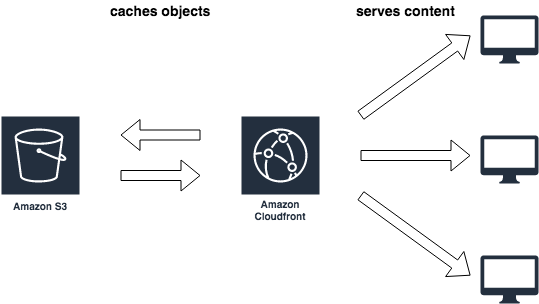

# Taking Care of Quizness Infrastructure

This project acts as the infrastructure as code (IaC) for the [taking-care-of-quizness-ui](../README.md) project. It utilizes [AWS's CDK framework](https://docs.aws.amazon.com/cdk/latest/guide/work-with.html) to automate the provisioning of AWS resources and the deployment of the frontend application. It was initialized with `npx aws-cdk init app --language javascript`.

## Project Structure

- **bin**: contains the executable code used to manage the frontend application.
- **lib**: contains the library of reusable pieces of code.

## Relevant AWS Services

- [CloudFront](https://aws.amazon.com/cloudfront/) - used as the Content Delivery Network (CDN) for our website
- [S3](https://aws.amazon.com/s3/) - used as the CloudFront origin that holds all the frontend build artifacts
- [CloudFormation](https://aws.amazon.com/cloudformation/) - used by CDK to provision resources
- [Lambda](https://aws.amazon.com/lambda/) - used by CDK to deploy resources and invalidate the CloudFront cache
- [IAM](https://aws.amazon.com/iam/) - used to create users and roles to execute tasks within AWS



## Continuous Deployment Setup

In order to handle continuous deployments via [Github Actions](https://github.com/features/actions) you will need to create an IAM user with programmatic access and the following policy permissions (make sure to replace all the `<[0-9a-zA-z-]*>` fields with the appropriate information):

### IAM Deployment Policy

```json
{
  "Version": "2012-10-17",
  "Statement": [
    {
      "Effect": "Allow",
      "Action": ["cloudformation:DescribeStacks", "cloudformation:GetTemplate"],
      "Resource": [
        "arn:aws:cloudformation:us-east-1:<aws-account-id>:stack/CDKToolkit*"
      ]
    },
    {
      "Effect": "Allow",
      "Action": ["s3:ListBucket", "s3:GetBucketLocation", "s3:PutObject"],
      "Resource": [
        "arn:aws:s3:::cdktoolkit-stagingbucket-<staging-bucket-id>",
        "arn:aws:s3:::cdktoolkit-stagingbucket-<staging-bucket-id>/*"
      ]
    },
    {
      "Effect": "Allow",
      "Action": [
        "cloudformation:CreateChangeSet",
        "cloudformation:DeleteChangeSet",
        "cloudformation:DescribeChangeSet",
        "cloudformation:ExecuteChangeSet",
        "cloudformation:DescribeStackEvents",
        "cloudformation:DescribeStacks",
        "cloudformation:GetTemplate"
      ],
      "Resource": "arn:aws:cloudformation:us-east-1:<aws-account-id>:stack/taking-care-of-quizness-ui/*"
    },
    {
      "Effect": "Allow",
      "Action": ["lambda:GetFunctionConfiguration", "lambda:InvokeFunction"],
      "Resource": "arn:aws:lambda:us-east-1:<aws-account-id>:function:<lambda-function-name>"
    }
  ]
}
```

Once the IAM user has been created you will need to add the `AWS_ACCESS_KEY_ID` and `AWS_SECRET_ACCESS_KEY` to your repository's [encrypted secrets](https://docs.github.com/en/actions/reference/encrypted-secrets#creating-encrypted-secrets-for-a-repository) in order to utilize them in the GitHub Action [release workflow](/.github/workflows/release.yml).

## Other Resources

[AWS CDK Examples](https://github.com/aws-samples/aws-cdk-examples/tree/master/typescript)

[Hosting a single page application with S3 and CloudFront](https://medium.com/@curtishughes017/hosting-a-single-page-application-with-s3-and-cloudfront-79e5f7c03738) - Shameless plug :stuck_out_tongue_winking_eye:
